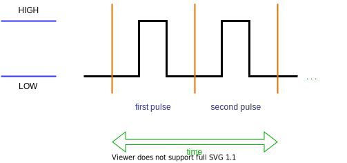
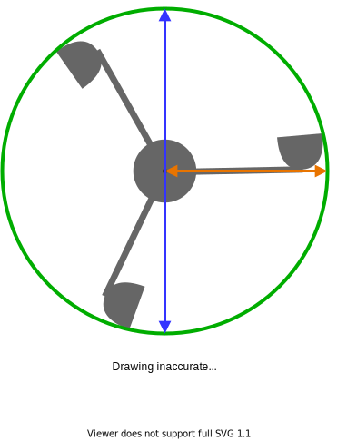

# node-anemometer

[](https://npmjs.org/package/node-anemometer)

## Install

```text
npm install node-anemometer
```

```text
pnpm install node-anemometer
```

```text
yarn add node-anemometer
```

## Required hardware

**At the moment this library can only be used with an extra counter module [PCF8583](https://www.nxp.com/docs/en/data-sheet/PCF8583.pdf)**

### The circuit board

There are several ways to count the revolutions of the anemometer. The best result I got with the KY-003 board (a magnetic field sensor) and a magnet. The magnet is placed so that it triggers the sensor with each complete rotation. If you use mechanical components like reed switches, you need a debounce filter and additional hardware to avoid count many [noise values](https://ptvo.info/zigbee-configurable-firmware-features/external-sensors/pcf8583-zigbee-counter/). There are many designs of such PCBs. Here is one example: [circuit board from Horter](https://www.horter.de/doku/i2c-counter-PCF8583_db.pdf)

## System settings

[Configuring I2C on the Raspberry Pi](https://github.com/fivdi/i2c-bus/blob/HEAD/doc/raspberry-pi-i2c.md)

[Creating Multiple I2C Ports](https://www-laub--home-de.translate.goog/wiki/Raspberry_Pi_multiple_I2C_bus?_x_tr_sl=de&_x_tr_tl=en&_x_tr_hl=de&_x_tr_pto=wapp) (_for advanced people_)

## Usage

Example in TypeScript (with ES Modules):

_Examples in the calculation not adjusted to your anemometer_

```typescript
import { Anemometer, calcFactor, WindSpeed, WindSpeedUnits } from 'node-anemometer';

const calc = (pulses: number, time: number): WindSpeed => {
  // You cannot divide by 0
  if (time <= 0) {
    return new WindSpeed(0, WindSpeedUnits.kilometersPerHour);
  }

  // More about the calculation can you find in the readme file
  const windSpeed = (pulses / 2 / time) * calcFactor(9, 1.18);

  // You must always return a class of the type WindSpeed
  return new WindSpeed(windSpeed, WindSpeedUnits.kilometersPerHour);
};

// Initialize the class for your anemometer.
// Never initialize two classes for the same address on the same bus!
// For more options on initializing the class, read the documentation
const myAnemometer = new Anemometer(calc);

async function start() {
  // Establish an i2c connection to the PCF8583 and start the reading process
  await myAnemometer.open();

  // Wait 60 seconds to have a usable average value
  setTimeout(async () => {
    // '.getAverageWindSpeed()' calculates the average wind speed of the past x seconds
    const average = myAnemometer.getAverageWindSpeed({ recentSeconds: 60 });
    console.log(`Average wind speed: ${average.rounded(2)} ${average.unit}`);

    // '.getPeakWindGust()' calculates the peak wind guest of the past x seconds
    const peak = myAnemometer.getPeakWindGust({ recentSeconds: 60 });
    console.log(`Peak wind speed: ${peak.rounded(2)} ${peak.unit}`);

    // Herewith you can stop the reading process and close the i2c connection
    await myAnemometer.close();
  }, 60000);
}

start();
```

You can find more information in the full [documentation 📖](https://julianwowra.github.io/node-anemometer/).

### Calculation

The wind speed is always calculated with the signals and the time. Often you can find information about this in the data sheet. If you can't find any, I will now describe how the calculation works.

The following basic equation applies:


**`pulses`**: Signals emitted by the anemometer. The are similar when you press a button

**`pulses per rotation`**: Is the number of signals that are output for a complete rotation

**`time`**: Is the duration (in seconds) in which the measurement was performed

**`anemometer factor`**: Mostly to find in the datasheet, but can also be calculated by yourself. More information below



### Calculate anemometor factor

The `.calcFactor()` function computes the multiplier for the calculation of the wind speed in km/h. The radius (measured distance from the center to the edge of one of the cups) in cm and the anemometer factor. The anemometer factor is a value to compensate for the lost wind energy when turning the arms. In my case this value is `1.18`.



---

## Useful information and references

**👉 Special thanks to [@DasMelone](https://github.com/DasMelone) who helped me to work out this project**

- 🌟 [Measuring wind speed using Raspberry Pi](https://projects.raspberrypi.org/en/projects/build-your-own-weather-station/5)
- 🌟 [Why a debounce filter?](https://ptvo.info/zigbee-configurable-firmware-features/external-sensors/pcf8583-zigbee-counter/)
- 🌟 🇩🇪 [Setting multiple i2c buses on the Raspberry Pi](https://www.laub-home.de/wiki/Raspberry_Pi_multiple_I2C_bus)
- 🇩🇪 [Video of the calculation with an Arduino](https://www.youtube.com/watch?v=Mr05UumeQsk)
- 🇩🇪 [I2C pulse counter module by Horter](https://www.nikolaus-lueneburg.de/2019/05/i2c-impuls-counter-modul/)
- [Counting events with Arduino and PCF8583](https://tinkerman.cat/post/counting-events-with-arduino-and-pcf8583/)
- [Low Power Counters](https://hackaday.io/project/174898-esp-now-weather-station/log/184063-low-power-counters)
- [What is a Schmitt trigger?](https://en.wikipedia.org/wiki/Schmitt_trigger)
- [Datasheet anemometer](https://www.argentdata.com/files/80422_datasheet.pdf)
- [Datasheet PCF8583](https://www.nxp.com/docs/en/data-sheet/PCF8583.pdf)
- [Datasheet 74HC132](https://assets.nexperia.com/documents/data-sheet/74HC_HCT132.pdf)

_🌟 - I recommend to read this_

_🇩🇪 - Content that is only available in German_

---

## Author

👤 **Julian Wowra <development@julianwowra.de>**

- Github: [@JulianWowra](https://github.com/JulianWowra)

## 🤝 Contributing

Contributions, issues and feature requests are welcome!<br />Feel free to check the [issues page](https://github.com/JulianWowra/node-anemometer/issues). You can also take a look at the [contributing guide](https://github.com/JulianWowra/node-anemometer/blob/main/CONTRIBUTING.md).
